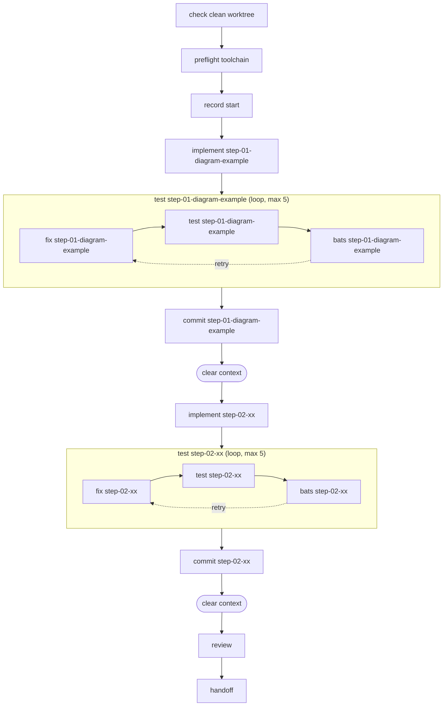

# implement_features

Dogfooding pipeline: implement features from step files in a directory.

## Inputs
- **args**: Path to directory containing step-*.md files

Environment variables: `ANTHROPIC_API_KEY`

## Pipeline

