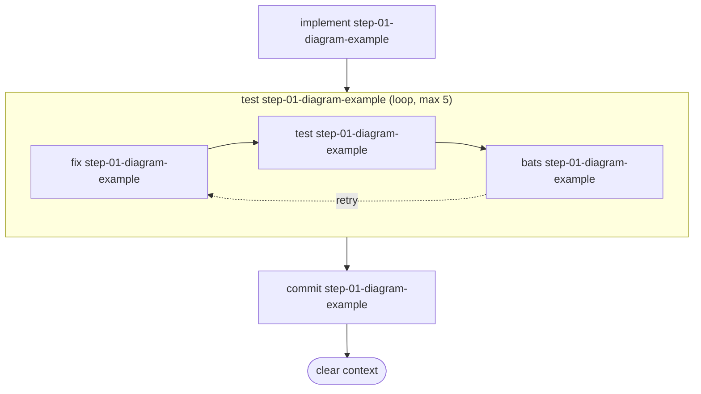

# implement_features

Dogfooding pipeline: implement features from step files in a directory.

## Pipeline

```mermaid
flowchart TD
    s1["implement step-01-diagram-example"]
    subgraph loop2 ["test step-01-diagram-example (loop, max 5)"]
    s3["fix step-01-diagram-example"]
    s4["test step-01-diagram-example"]
    s5["bats step-01-diagram-example"]
        s3 --> s4
        s4 --> s5
        s5 -. retry .-> s3
    end
    s6["commit step-01-diagram-example"]
    cc7(["clear context"])
    s1 --> loop2
    loop2 --> s6
    s6 --> cc7
```

