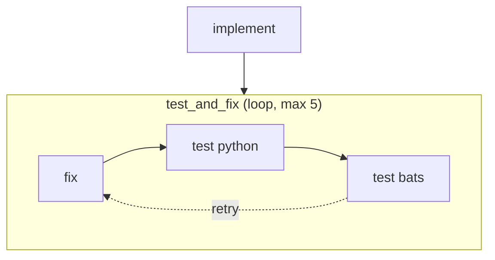

```mermaid
flowchart TD
    s1["implement"]
    subgraph loop2 ["test_and_fix (loop, max 5)"]
    s3["fix"]
    s4["test python"]
    s5["test bats"]
        s3 --> s4
        s4 --> s5
        s5 -. retry .-> s3
    end
    s1 --> loop2

```