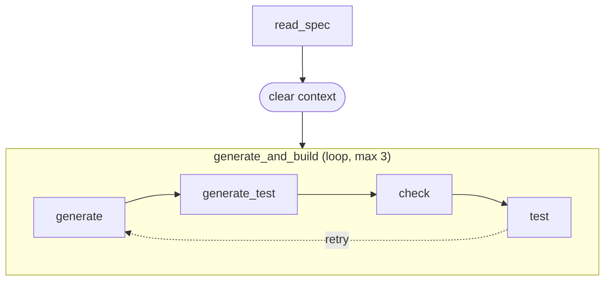

# hello

Example pipeline: read a spec, generate a Python class, compile-check it, run tests.

## Pipeline

```mermaid
flowchart TD
    s1["read_spec"]
    cc2(["clear context"])
    subgraph loop3 ["generate_and_build (loop, max 3)"]
    s4["generate"]
    s5["generate_test"]
    s6["check"]
    s7["test"]
        s4 --> s5
        s5 --> s6
        s6 --> s7
        s7 -. retry .-> s4
    end
    s1 --> cc2
    cc2 --> loop3
```

