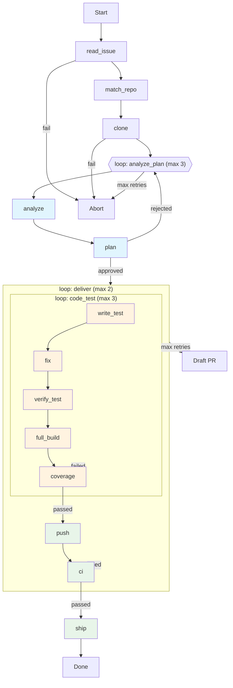
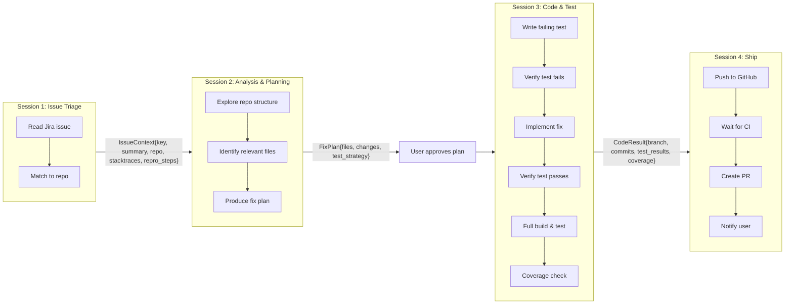

# IssueProcessing Pipeline — Main Plan

Automated pipeline that reads a Jira issue and produces a GitHub PR with a fix, using Claude as the coding agent.

## Requirements

### Core Pipeline
1. Read a Jira issue (summary, description, comments, attachments, stacktraces, custom fields)
2. Match the issue to a GitHub repo using pluggable strategies (component mapping, label mapping, stacktrace class extraction + GitHub code search, keyword matching, LLM inference)
3. Clone the repo as `{repo_name}-{issue_key}`, create branch `{issue_key}-{slugified_title}`
4. Analyze the issue in context of the repo — identify relevant files, gather additional context (logs, DB, attachments). Stop and ask user if insufficient.
5. Create a fix plan — which files to change, what to fix, which tests to write. User must approve.
6. Write a failing test that reproduces the bug. Verify it fails as expected.
7. Implement the fix.
8. Rerun test, verify it passes.
9. Full project build and test.
10. Coverage check — verify the new test exercises the changed code.
11. Push to GitHub.
12. Wait for CI workflows to pass.
13. Create PR and notify user.

### Pluggability
- Must work across **different GitHub organizations** — adding a new org requires no code changes, only a new config file.
- All major components are pluggable: issue sources (Jira now, GitHub Issues/Linear future), repo matchers, VCS providers (GitHub now, GitLab/Bitbucket future), CI systems, build systems, notification channels, credential providers.
- Each pluggable component is an abstract base class with concrete implementations.

### Configuration via Python DSL
- Org configs are **external Python files** in `~/.issueprocessing/orgs/`, loaded dynamically via `importlib`.
- No YAML/TOML — the DSL is Python so it supports conditional logic, composition, and inheritance.
- The DSL mirrors the pipeline structure: stages, loops, and `clear_context()` directives.
- Stages are **named and generic** (not hardcoded step numbers) so they can be reordered, skipped, replaced, or extended.
- Configs are composable: `base.derive("staging")` inherits everything, overrides only what differs.

### Session & Context Management
- The pipeline runs **multiple agent sessions** with context cleared between them.
- `clear_context()` is an explicit DSL directive placeable anywhere — sheds the agent conversation, keeps only structured outputs (`IssueContext`, `FixPlan`, `CodeResult`).
- Sessions have scoped tool permissions: analysis is read-only (`Read`, `Grep`, `Glob`), coding has full access with hooks blocking dangerous commands, shipping has no code editing.

### Loop / Retry Logic
- Retry logic uses **do-while loops** wrapping groups of stages, not goto-style jumps.
- Loops are nestable: `deliver` (outer) wraps `code_test` (inner) + push + CI. If CI fails, the whole deliver loop restarts with CI failure logs as context.
- Each loop has `max_retries` and `on_exhaust` (fail, ask_user, or draft_pr).
- Stages within a loop share context for that iteration.

### Repo Matching Strategies
- Component matcher — Jira component field maps to a repo.
- Label matcher — Jira labels map to a repo.
- **Stacktrace matcher** — extract fully qualified class/package names from stacktraces, search across the GitHub org using code search API. Strongest signal when multiple classes point to the same repo.
- Keyword matcher — title/description keywords match known repo names.
- LLM matcher — Claude infers the most likely repo from issue content.
- Matchers run in configured priority order; first match above confidence threshold wins.

### Technology Stack
- **claude-agent-sdk** (Python) — wraps Claude Code with hooks, custom MCP tools, bidirectional sessions.
- **atlassian-python-api** — Jira issue reading.
- **GitPython** — clone, branch, commit, push.
- **PyGithub / gh CLI** — PRs, workflow status, code search.
- **pydantic** — config validation.
- **Python >= 3.13**, async throughout.

### Access & Security
- Per-org credentials resolved from env vars (`ISSUEPROC_{ORG}_GITHUB_TOKEN`) or pluggable secrets manager.
- Never store credentials in config files.
- Agent sandboxing (Docker recommended) for coding sessions.
- Blocked command patterns configurable per org.
- Principle of least privilege per session phase.

## Flow Diagram



The loops are nested:
- **`code_test`** (inner) — write test, fix, verify, build, coverage. Repeats if any stage fails.
- **`deliver`** (outer) — wraps code_test + push + ci. If CI fails, the whole thing restarts from write_test with CI failure logs as additional context.
- **`analyze_plan`** — analyze + plan. Repeats if plan is rejected.

## Pipeline Steps & Session Architecture

The pipeline uses **four distinct agent sessions** with context cleared between them. Each session gets only the structured output from prior sessions — no leftover conversation context. The orchestrator (pure Python, no LLM) manages state and handoffs.



### Session 1: Issue Triage (steps 1-2.5)

**Input:** Jira issue key + org config
**Agent tools:** `jira_get_issue`, `jira_get_attachments`, `github_search_code`, `github_list_repos`
**Context cleared after this session.**

#### Step 1: Read Jira Issue
- Fetch issue details via `atlassian-python-api`: summary, description, comments, attachments, labels, components, linked issues, custom fields.
- Extract stack traces, log snippets, reproduction steps from description and comments.

#### Step 2: Match Issue to Repo
- Run a chain of matchers (pluggable, per-org config):
  1. **Component matcher** — Jira component field maps to a repo.
  2. **Label matcher** — Jira labels map to a repo.
  3. **Stacktrace matcher** — Extract fully qualified class/package names from stack traces in the issue description and comments. Search across the GitHub org's repos using the GitHub code search API (`gh api search/code`) to find which repo contains those classes. Strongest signal when multiple classes from the same trace point to the same repo.
  4. **Keyword matcher** — Title/description keywords match known repo names.
  5. **LLM matcher** — Use Claude to infer the most likely repo from issue content and a list of candidate repos.
- Matchers run in priority order; first match above confidence threshold wins.
- If confidence is below threshold, ask the user.

#### Step 2.5: Clone Repo & Create Branch
- Orchestrator (no LLM needed) clones to `<repo-name>-<JIRA-KEY>` directory.
- Create branch `<JIRA-KEY>-<slugified-title>`.
- Checkout branch.

**Output → `IssueContext`:**
```python
@dataclass
class IssueContext:
    key: str                    # e.g. "BACKEND-1234"
    summary: str
    description: str
    stacktraces: list[str]
    repro_steps: str | None
    attachments: list[Path]     # downloaded locally
    repo: str                   # e.g. "acme-corp/auth-service"
    local_path: Path            # cloned repo path
    branch: str                 # created branch name
```

---

### Session 2: Analysis & Planning (steps 3-4)

**Input:** `IssueContext` + cloned repo as working directory
**Agent tools:** Built-in `Read`, `Grep`, `Glob` (repo exploration only). No `Edit`/`Write`/`Bash` — this session is read-only.
**Context cleared after this session.**

#### Step 3: Analyze Issue Context
- Claude explores the cloned repo using `Read`, `Grep`, `Glob`.
- Correlates stacktraces/error messages with source files.
- Identifies relevant source files, modules, and dependencies.
- If issue references logs, DB state, or external systems, returns a structured request for more context.
- Orchestrator asks user if information is insufficient, then re-runs session 2 with additional context appended.

#### Step 4: Create Fix Plan
- Claude produces a structured plan: which files to change, what the fix looks like, which tests to write.
- **Orchestrator presents plan to user for approval.**
- If rejected, user provides feedback, session 2 re-runs with feedback appended.
- Loop until approved.

**Output → `FixPlan`:**
```python
@dataclass
class FixPlan:
    analysis: str               # What's wrong and why
    files_to_change: list[FileChange]  # path, what to change, why
    test_strategy: str          # What test to write, how it reproduces the bug
    test_files: list[str]       # Where to put tests
    risks: list[str]            # Potential side effects
    confidence: float           # 0-1, how confident Claude is in this plan
```

**User approval gate here.** Session 2 context is discarded. Only the approved `FixPlan` moves forward.

---

### Session 3: Code & Test (steps 5-8.5)

**Input:** `IssueContext` + approved `FixPlan` + cloned repo as working directory
**Agent tools:** Full access — `Read`, `Edit`, `Write`, `Bash`, `Grep`, `Glob` + custom `run_tests`, `run_coverage`
**Hooks:** Block dangerous commands (`rm -rf`, `DROP TABLE`, file access outside repo)
**Context cleared after this session.**

#### Step 5: Write Failing Test
- Claude writes a test that reproduces the bug, following `test_strategy` from the plan.
- Uses custom `run_tests` tool to execute — verifies it **fails** with the expected error.
- If the test passes (bug not reproduced), Claude adjusts the test or flags that the plan needs revision.

#### Step 6: Implement Fix
- Claude implements the fix according to the approved `FixPlan`.
- Keep changes minimal and focused.

#### Step 7: Rerun Test
- Run the new test via `run_tests` and verify it **passes**.
- If it fails, Claude iterates on the fix (max retries from config).

#### Step 8: Full Build & Test
- Run the full project build and test suite via `run_tests(full=True)`.
- If failures occur, Claude analyzes and fixes (may loop).

#### Step 8.5: Coverage Check
- Run `run_coverage` on the changed files.
- Verify that the new test actually exercises the changed lines.
- If coverage is insufficient, Claude adds more test cases.

**Output → `CodeResult`:**
```python
@dataclass
class CodeResult:
    local_path: Path
    branch: str
    commits: list[str]          # commit SHAs
    test_results: TestResult    # pass/fail counts, output
    coverage: CoverageReport    # changed lines covered %
    files_changed: list[str]
```

---

### Session 4: Ship (steps 9-11)

**Input:** `IssueContext` + `FixPlan` + `CodeResult`
**Agent tools:** `create_pr`, `check_ci_status`, `notify` (custom MCP tools). No code editing.
**This session may be mostly orchestrator-driven (no LLM needed for push/PR/poll).**

#### Step 9: Push to GitHub
- Orchestrator pushes branch to remote (no LLM needed).

#### Step 10: Wait for CI Workflows
- Orchestrator polls GitHub Actions via `check_ci_status` for workflow completion.
- Timeout after configurable duration.
- If workflows fail: **new Session 3** is started with the CI failure logs appended to context. This is a fresh coding session to fix the CI issue.

#### Step 11: Create PR & Notify User
- Orchestrator creates PR via `gh` CLI. Title references Jira key, body includes:
  - Link to Jira issue
  - Summary from `FixPlan.analysis`
  - Test results from `CodeResult`
  - Coverage report
- Optional: invoke `/review-pr` skill for self-review before creating PR.
- Send notification via configured channels (Slack, email, webhook).

**Output → `PipelineResult`:**
```python
@dataclass
class PipelineResult:
    jira_key: str
    pr_url: str
    status: str                 # "success" | "partial" | "failed"
    summary: str
```

---

### Why Clear Context Between Sessions

| Reason | Detail |
|---|---|
| **Focus** | Each session gets a clean, focused prompt. Session 3 doesn't carry 50k tokens of repo-matching deliberation from session 1. |
| **Cost** | Shorter contexts = fewer tokens = lower API cost. Session 1 (triage) is cheap. Session 3 (coding) uses tokens on code, not stale issue analysis. |
| **Debuggability** | Each session's input/output is a well-defined struct. Easy to log, replay, or retry a single session. |
| **Resumability** | If session 3 crashes, restart it with the same `IssueContext` + `FixPlan`. No need to reconstruct a conversation. |
| **Security** | Session 2 is read-only (no `Edit`/`Bash`). Session 3 has write access but hooks block dangerous ops. Session 4 has no code editing at all. Principle of least privilege per phase. |

## Tools & SDKs

| Dependency | Purpose | PyPI Package |
|---|---|---|
| **claude-agent-sdk** | Orchestrate Claude as the AI coding agent (steps 3-8) with hooks and custom tools | `claude-agent-sdk` |
| **atlassian-python-api** | Read Jira issues, comments, attachments, custom fields | `atlassian-python-api` |
| **PyGithub** or **gh CLI** | Create PRs, check workflow status, manage repos, code search across org | `PyGithub` / `gh` |
| **GitPython** | Clone repos, create branches, commit, push | `GitPython` |
| **pydantic** | Configuration models, validation | `pydantic` |
| **typer** | CLI interface | `typer` |
| **coverage.py** | Parse coverage reports for step 8.5 | `coverage` |

### Why claude-agent-sdk

The `claude-agent-sdk` (Python) wraps Claude Code and provides:
- `query()` for simple one-shot prompts (async iterator over responses).
- `ClaudeSDKClient` for bidirectional, interactive conversations with hooks and custom tools.
- `@tool` decorator + `create_sdk_mcp_server()` to define custom Python tools that Claude can invoke (e.g., Jira lookup, coverage parsing).
- `HookMatcher` for pre/post tool-use hooks — lets us gate dangerous operations (e.g., block `rm -rf`, restrict file access to cloned repo).
- Built-in access to Claude Code's `Bash`, `Read`, `Edit`, `Write`, `Grep`, `Glob` tools — no need to build file I/O or shell execution from scratch.
- `allowed_tools` to pre-approve tools and avoid interactive permission prompts in automation.

This makes it the right choice over raw `claude-code-sdk` (which is lower-level and lacks hooks/custom tools).

## Access & Credentials Required

### Per-org Credentials (stored as env vars or secrets manager, never in config files)

| Credential | Used In | Purpose | Required Scopes / Permissions |
|---|---|---|---|
| **Jira API Token** | Step 1 | Read issues, comments, attachments | Project read access. Jira Cloud: email + API token. Jira Server: PAT or basic auth. |
| **GitHub PAT or App Token** | Steps 2, 2.5, 9, 10, 11 | Clone private repos, push branches, create PRs, read workflow status, code search | `repo` (full), `workflow` (read), `read:org` (for org repo listing) |
| **Anthropic API Key** | Steps 2-8 | Claude agent SDK calls | Set via `ANTHROPIC_API_KEY` env var |
| **Slack Bot Token** (optional) | Step 11 | Post notifications | `chat:write` scope to target channel |
| **Email SMTP credentials** (optional) | Step 11 | Send notification emails | SMTP host/port/user/pass |

### System Prerequisites

| Prerequisite | Used In | Notes |
|---|---|---|
| **Python >= 3.13** | All | As per pyproject.toml |
| **git CLI** | Steps 2.5, 9 | GitPython shells out to git |
| **gh CLI** | Steps 2, 10, 11 | GitHub code search, workflow status, PR creation |
| **Claude Code CLI** | Steps 3-8 | claude-agent-sdk wraps the Claude Code CLI process |
| **Build tools per target repo** | Steps 5-8 | Maven/Gradle for Java, npm for JS, etc. — must be available on the machine |
| **Docker** (recommended) | Steps 5-8 | Sandbox agent execution in a container |

### Credential Resolution Order

1. Org-specific env var: `ISSUEPROC_<ORG>_GITHUB_TOKEN`, `ISSUEPROC_<ORG>_JIRA_TOKEN`
2. Global env var: `GITHUB_TOKEN`, `JIRA_TOKEN`
3. Secrets manager (AWS SSM, Vault, etc.) — pluggable via `credentials/` module
4. Interactive prompt (last resort, only in non-headless mode)

## Skills Integration

Claude Code skills from the user's environment that should be incorporated into pipeline phases:

| Skill | Pipeline Phase | How It's Used |
|---|---|---|
| **jira** (`/jira`) | Step 1: Read Issue | Primary interface for fetching issue details. Invoke via `ClaudeSDKClient` custom tool or directly in orchestrator. Handles Jira URLs and issue keys (e.g., `CBS-2249`). |
| **find-docs** | Steps 3-4: Analyze & Plan | Retrieve up-to-date documentation for libraries referenced in the issue or codebase. Helps Claude understand framework-specific APIs when planning the fix. |
| **check-build** (`/check-build`) | Step 10: CI Verification | Given a GitHub Actions run URL, fetches run details, identifies failures, and traces back to causing commits. Use after push to diagnose CI failures. |
| **review-pr** (`/review-pr`) | Step 11: Pre-PR Quality Gate | Self-review the diff before creating the PR. Catches security vulnerabilities, null safety issues, code quality problems. Run as an optional validation step. |
| **claude-api** | Agent orchestration | Ensures correct usage of Anthropic SDK patterns when building the pipeline itself. |
| **read-servicenow** (`/read-servicenow`) | Step 1 (optional) | If the Jira issue links to a ServiceNow incident HTML file, extract additional context from it. |

### Custom MCP Tools to Build

These are project-specific tools exposed to the Claude agent via `@tool` + `create_sdk_mcp_server()`:

| Tool Name | Phase | Description |
|---|---|---|
| `jira_get_issue` | Step 1 | Wraps `atlassian-python-api` to fetch issue with all fields, comments, attachments |
| `jira_get_attachments` | Step 1, 3 | Download and return attachment contents (logs, configs, screenshots) |
| `github_search_code` | Step 2 | Search for class/package names across org repos via `gh api search/code` |
| `github_list_repos` | Step 2 | List repos in the configured org for matcher candidates |
| `run_tests` | Steps 5, 7, 8 | Execute project-specific test command (Maven, pytest, npm test, etc.) and return structured results |
| `run_coverage` | Step 8.5 | Run coverage tool, parse report, return coverage data for changed files |
| `check_ci_status` | Step 10 | Poll GitHub Actions workflow runs for the pushed branch |
| `create_pr` | Step 11 | Create PR with structured body, link to Jira issue |
| `notify` | Step 11 | Send notification via configured channel (Slack, email, webhook) |

## Pluggable Architecture

```
issueprocessing/
├── config/
│   ├── models.py            # Pydantic models (internal representation)
│   └── loader.py            # Dynamically import .py configs from external dir
├── dsl.py                    # Public DSL: Org, Jira, GitHub, MatcherChain, etc.
├── sources/
│   ├── base.py               # Abstract IssueSource
│   ├── jira_source.py         # Jira implementation
│   └── (future: github_issues, linear, etc.)
├── matchers/
│   ├── base.py               # Abstract RepoMatcher
│   ├── component_matcher.py  # Match by Jira component field
│   ├── label_matcher.py      # Match by labels
│   ├── stacktrace_matcher.py # Extract classes from stacktraces, search GitHub org
│   ├── keyword_matcher.py    # Match by title/description keywords
│   └── llm_matcher.py        # Use Claude to infer repo
├── sessions/
│   ├── base.py               # Base session: creates ClaudeSDKClient, manages lifecycle
│   ├── triage.py             # Session 1: read issue + match repo (steps 1-2)
│   ├── analysis.py           # Session 2: explore repo + produce plan (steps 3-4, read-only)
│   ├── coding.py             # Session 3: write test + fix + build (steps 5-8.5, full access)
│   └── shipping.py           # Session 4: push + PR + notify (steps 9-11, mostly orchestrator)
├── models/
│   ├── issue_context.py      # IssueContext dataclass — output of session 1
│   ├── fix_plan.py           # FixPlan dataclass — output of session 2
│   ├── code_result.py        # CodeResult dataclass — output of session 3
│   └── pipeline_result.py    # PipelineResult dataclass — final output
├── vcs/
│   ├── base.py               # Abstract VCS provider
│   ├── github_provider.py    # GitHub: clone, push, PR, workflow checks
│   └── (future: gitlab, bitbucket)
├── notifications/
│   ├── base.py               # Abstract notifier
│   ├── slack_notifier.py
│   └── email_notifier.py
├── cli.py                    # Entry point
└── pipeline.py               # Step sequencing & state machine
```

### Per-org Configuration (Python DSL)

Org configs are **Python files** stored in an external config directory (`~/.issueprocessing/orgs/` or a path set via `ISSUEPROC_CONFIG_DIR`). Adding a new org means dropping a new `.py` file — no changes to the main project.

The pipeline dynamically loads configs by importing them from the config directory (like Django settings or pytest conftest). The org is selected by matching the Jira project key or explicitly via CLI flag (`--org acme`).

```
~/.issueprocessing/
├── base.py                    # Shared defaults, inherited by all orgs
└── orgs/
    ├── acme.py
    ├── contoso.py
    └── acme_staging.py        # Variant: derives from acme
```

#### Example: `acme.py`

```python
from issueprocessing.dsl import *

config = (
    Pipeline("acme", github_org="acme-corp")
    .credentials(provider="env")

    # Pipeline is a sequence of stages, loops, and clear_context() directives.
    #
    # .stage("name", StageType(...))  — runs once, proceeds to next on success
    # .loop("name", max_retries=N, on_exhaust=..., stages=[...])
    #     — repeats all stages until they all pass, or max_retries is hit
    # .clear_context()
    #     — discards the current agent session. Next stage starts fresh,
    #       receiving only the structured outputs from prior stages.
    #       Place this wherever you want to shed accumulated context.
    #
    # on_failure / on_exhaust options:
    #   fail      — abort the pipeline
    #   ask_user  — pause and let the user decide
    #   draft_pr  — create a draft PR with what we have

    .stage("read_issue",
        ReadIssue(
            Jira("https://acme.atlassian.net")
            .projects("BACKEND", "FRONTEND", "INFRA")
            .auth("api_token")
            .include_comments(True)
            .include_attachments(True)
            .extract_stacktraces(True)
        ),
        on_failure=fail,
    )

    .stage("match_repo",
        MatchRepo(
            MatcherChain(threshold=0.7)
            .add(component({
                "auth-service": "acme-corp/auth-service",
                "web-app": "acme-corp/web-frontend",
                "payment-gateway": "acme-corp/payments",
            }))
            .add(label({
                "backend": "acme-corp/api-server",
                "infra": "acme-corp/infrastructure",
            }))
            .add(stacktrace())
            .add(keyword())
            .add(llm(model="claude-sonnet-4-6"))
        ),
        on_failure=ask_user,
    )

    .stage("clone",
        Clone(
            clone_dir="/tmp/issueprocessing/clones",
            branch_format="{issue_key}-{slugified_title}",
            dir_format="{repo_name}-{issue_key}",
            default_branch="main",
            fork=False,
        ),
        on_failure=fail,
    )

    # Triage is done. Discard the matching/cloning context.
    # From here on, stages only see IssueContext (structured output from above).
    .clear_context()

    .loop("analyze_plan", max_retries=3, on_exhaust=fail,
        stages=[
            Stage("analyze",
                Analyze(tools=["Read", "Grep", "Glob"]),
                on_failure=ask_user,
            ),
            Stage("plan",
                Plan(require_approval=True, include_risk_assessment=True),
            ),
        ]
    )

    # Plan approved. Discard the analysis conversation.
    # From here on, stages see IssueContext + FixPlan.
    .clear_context()

    .loop("deliver", max_retries=2, on_exhaust=draft_pr,
        stages=[

            Loop("code_test", max_retries=3, on_exhaust=ask_user,
                stages=[
                    Stage("write_test", WriteTest()),
                    Stage("fix",
                        Fix(
                            tools=["Read", "Edit", "Write", "Bash", "Grep", "Glob"],
                            sandbox="docker",
                            blocked_patterns=["rm -rf /", "DROP TABLE", "force push"],
                        ),
                    ),
                    Stage("verify_test", VerifyTest()),
                    Stage("full_build",
                        FullBuild(
                            auto_detect=True,
                            overrides={
                                "acme-corp/legacy-app": Maven(java_version=11, cmd="mvn verify"),
                                "acme-corp/web-frontend": Npm(cmd="npm run test:ci"),
                            },
                        ),
                    ),
                    Stage("coverage", Coverage(min_pct=80)),
                ]
            ),

            Stage("push", Push(commit_format="[{issue_key}] {summary}")),
            Stage("ci", CI(poll_interval=30, timeout_minutes=30)),
            # If CI fails → deliver loop restarts from code_test
            # with CI failure logs injected into context
        ]
    )

    # Code is delivered. Discard coding context.
    # Ship only needs IssueContext + FixPlan + CodeResult.
    .clear_context()

    .stage("ship",
        Ship(
            pr_title_format="[{issue_key}] {summary}",
            pr_body_includes=["jira_link", "analysis", "test_results", "coverage"],
            self_review=True,
            notify=[
                Slack("#dev-alerts", on=["pr_created", "ci_failed"]),
                Email("team-lead@acme.com", on=["pipeline_failed"]),
            ],
        ),
        on_failure=ask_user,
    )
)
```

#### Skip, replace, or insert into loops

```python
from issueprocessing.dsl import *
from acme import config as base

# Modify the inner code_test loop: skip coverage, add lint after fix
config = (
    base.derive("acme-fast")
    .in_loop("deliver.code_test")  # dot notation for nested loops
        .skip("coverage")
        .replace("fix", Fix(sandbox="none"))
        .insert_after("fix", Stage("lint", Lint(cmd="ruff check --fix")))
    .end_loop()
)
```

#### Composition: `acme_staging.py`

```python
from issueprocessing.dsl import *
from acme import config as base

config = (
    base.derive("acme-staging")
    .replace("clone", Clone(clone_dir="/tmp/issueproc-staging"))
    .in_loop("deliver.code_test")
        .replace("fix", Fix(sandbox="none"))
    .end_loop()
    .replace("ship", Ship(
        pr_title_format="[STAGING] [{issue_key}] {summary}",
        notify=[Slack("#staging-alerts", on=["pr_created", "pipeline_failed"])],
    ))
)
```

#### Conditional logic — something TOML/YAML can't do

```python
import os
from issueprocessing.dsl import *

env = os.getenv("DEPLOY_ENV", "dev")

config = (
    Pipeline("acme", github_org="acme-corp")
    .credentials(provider="vault" if env == "prod" else "env")

    .stage("read_issue", ReadIssue(
        Jira("https://acme.atlassian.net").projects("BACKEND")
    ), on_failure=fail)

    .stage("match_repo", MatchRepo(
        MatcherChain(threshold=0.9 if env == "prod" else 0.7)
        .add(component({...}))
        .add(stacktrace())
        .add(llm())
    ), on_failure=ask_user)

    .stage("clone", Clone(fork=(env == "prod")), on_failure=fail)

    .loop("analyze_plan", max_retries=3, on_exhaust=fail,
        stages=[
            Stage("analyze", Analyze()),
            Stage("plan", Plan(require_approval=True)),
        ]
    )

    .loop("deliver",
        max_retries=2 if env == "prod" else 1,
        on_exhaust=fail if env == "prod" else draft_pr,
        stages=[
            Loop("code_test",
                max_retries=5 if env == "prod" else 3,
                on_exhaust=ask_user,
                stages=[
                    Stage("write_test", WriteTest()),
                    Stage("fix", Fix(sandbox="docker" if env == "prod" else "none")),
                    Stage("verify_test", VerifyTest()),
                    Stage("full_build", FullBuild()),
                    Stage("coverage", Coverage()),
                ]
            ),
            Stage("push", Push()),
            Stage("ci", CI()),
        ]
    )

    .stage("ship", Ship(
        notify=[
            Slack("#dev-alerts", on=["pr_created"]),
            *([ PagerDuty("oncall", on=["pipeline_failed"]) ] if env == "prod" else []),
        ],
    ), on_failure=ask_user)
)
```

#### Custom stages

You can define your own stage types for org-specific needs:

```python
from issueprocessing.dsl import Stage

class SecurityScan(Stage):
    """Run Snyk/Trivy/etc. after build, before push."""
    def __init__(self, tool="snyk", fail_on="critical"):
        self.tool = tool
        self.fail_on = fail_on

    async def run(self, ctx: PipelineContext) -> StageResult:
        # ctx gives access to repo path, issue context, previous stage outputs
        ...

# Use it:
config = (
    base.derive("acme-secure")
    .insert_after("full_build", "security_scan", SecurityScan(tool="snyk"))
)
```

#### Config Loading

```python
# Internals — the loader dynamically imports .py files from the config dir.
import importlib.util

def load_org_config(org_name: str) -> OrgConfig:
    config_dir = os.getenv("ISSUEPROC_CONFIG_DIR", "~/.issueprocessing/orgs")
    spec = importlib.util.spec_from_file_location(
        f"org_{org_name}", Path(config_dir).expanduser() / f"{org_name}.py"
    )
    module = importlib.util.module_from_spec(spec)
    spec.loader.exec_module(module)
    return module.config.build()  # .build() validates via Pydantic and freezes
```

#### The DSL classes (`issueprocessing/dsl.py`)

All DSL classes are thin builders that produce validated Pydantic models on `.build()`. The DSL is the public API; the Pydantic models are the internal representation.

```python
# Users write:     Org("acme").vcs(GitHub(...))
# Internally:      OrgConfig(name="acme", vcs=VCSConfig(type="github", ...))
```

### Pluggability Points & Interface Contracts

Each extension point is an abstract base class (ABC) with a registry. New implementations are registered via config — no code changes needed to add a new org.

#### 1. Issue Sources (`sources/base.py`)
```python
class IssueSource(ABC):
    async def get_issue(self, key: str) -> Issue: ...
    async def get_comments(self, key: str) -> list[Comment]: ...
    async def get_attachments(self, key: str) -> list[Attachment]: ...
    async def add_comment(self, key: str, body: str) -> None: ...
```
- **Jira** (implemented) — via `atlassian-python-api`
- Future: GitHub Issues, Linear, ServiceNow

#### 2. Repo Matchers (`matchers/base.py`)
```python
class RepoMatcher(ABC):
    async def match(self, issue: Issue, candidates: list[Repo]) -> MatchResult: ...
    # MatchResult: repo, confidence (0-1), reasoning
```
- Configured as ordered list per org. Pipeline runs them in sequence, stops at first match above threshold.
- Each org can enable/disable/reorder matchers and set confidence thresholds in config.

#### 3. VCS Providers (`vcs/base.py`)
```python
class VCSProvider(ABC):
    async def clone(self, repo_url: str, target_dir: str) -> LocalRepo: ...
    async def create_branch(self, repo: LocalRepo, name: str) -> None: ...
    async def push(self, repo: LocalRepo, branch: str) -> None: ...
    async def create_pr(self, repo: LocalRepo, title: str, body: str, base: str) -> str: ...
    async def get_ci_status(self, repo: LocalRepo, branch: str) -> CIStatus: ...
    async def search_code(self, org: str, query: str) -> list[CodeSearchResult]: ...
```
- **GitHub** (implemented) — via `gh` CLI and/or PyGithub
- Future: GitLab, Bitbucket

#### 4. CI Providers (`ci/base.py`)
```python
class CIProvider(ABC):
    async def get_workflow_runs(self, repo: str, branch: str) -> list[WorkflowRun]: ...
    async def get_run_logs(self, run_id: str) -> str: ...
    async def wait_for_completion(self, run_id: str, timeout: int) -> CIResult: ...
```
- **GitHub Actions** (implemented)
- Future: Jenkins, CircleCI, Azure DevOps

#### 5. Build Systems (`builds/base.py`)
```python
class BuildSystem(ABC):
    def detect(self, repo_path: str) -> bool: ...  # Auto-detect from project files
    async def build(self, repo_path: str) -> BuildResult: ...
    async def test(self, repo_path: str, test_filter: str | None) -> TestResult: ...
    async def coverage(self, repo_path: str) -> CoverageReport: ...
```
- Auto-detected from project files: `pom.xml` → Maven, `build.gradle` → Gradle, `package.json` → npm, `pyproject.toml` → pytest, etc.
- Each org can override detection or pin a specific build system in config.

#### 6. Notification Channels (`notifications/base.py`)
```python
class Notifier(ABC):
    async def notify(self, event: PipelineEvent, context: PipelineContext) -> None: ...
```
- **Slack** — bot token + channel
- **Email** — SMTP
- **Webhook** — generic HTTP POST
- Multiple notifiers can be active simultaneously per org.

#### 7. Credential Providers (`credentials/base.py`)
```python
class CredentialProvider(ABC):
    async def get(self, key: str, org: str | None) -> str: ...
```
- **EnvVar** (default) — `ISSUEPROC_<ORG>_<KEY>` or `<KEY>`
- **AWS SSM** — AWS Systems Manager Parameter Store
- **Vault** — HashiCorp Vault
- **Keyring** — OS keychain (for local dev)

### Per-org Config — Full Example

```yaml
org_name: acme
github_org: acme-corp

# Credentials
credentials:
  provider: env  # env | aws_ssm | vault | keyring
  # For env provider, expects: ISSUEPROC_ACME_GITHUB_TOKEN, ISSUEPROC_ACME_JIRA_TOKEN, etc.

# Issue source
issue_source:
  type: jira
  url: https://acme.atlassian.net
  project_keys: [BACKEND, FRONTEND, INFRA]
  auth: api_token  # api_token | pat | oauth

# Repo matching
repo_matching:
  confidence_threshold: 0.7
  strategies:
    - type: component
      component_map:
        auth-service: acme-corp/auth-service
        web-app: acme-corp/web-frontend
    - type: label
      label_map:
        backend: acme-corp/api-server
        infra: acme-corp/infrastructure
    - type: stacktrace
      # No config needed — extracts classes and searches GitHub org
    - type: keyword
    - type: llm
      model: claude-sonnet-4-6  # cheaper model for matching

# VCS
vcs:
  type: github
  clone_dir: /tmp/issueprocessing/clones
  default_branch: main
  fork: false  # true = fork + PR, false = branch + PR

# CI
ci:
  type: github_actions
  poll_interval_seconds: 30
  timeout_minutes: 30

# Build (auto-detected per repo, but can override)
build_overrides:
  acme-corp/legacy-app:
    type: maven
    java_version: 11
    test_command: "mvn verify -pl changed-module"

# Notifications
notifications:
  - type: slack
    channel: "#dev-alerts"
    events: [pr_created, ci_failed, pipeline_failed]
  - type: email
    recipients: ["team-lead@acme.com"]
    events: [pipeline_failed]

# Agent behavior
agent:
  max_retries_per_step: 3
  sandbox: docker  # docker | none
  allowed_tools: [Bash, Read, Edit, Write, Grep, Glob]
  blocked_patterns: ["rm -rf /", "DROP TABLE", "force push"]
  human_approval_steps: [plan]  # Which steps require user approval
```

## Risks & Mitigations

| Risk | Severity | Mitigation |
|---|---|---|
| **Claude can't fix the bug** — too complex, requires domain knowledge, or touches infra | High | Step 4 plan approval is a gate. Add a "bail out" path: create draft PR with analysis notes instead of a fix. |
| **Repo matching fails** — ambiguous mapping, monorepo, missing metadata | Medium | Chain matchers with fallback. LLM matcher as last resort. Always ask user if confidence < threshold. |
| **Test doesn't reproduce the bug** — vague description, env-specific bug | High | Step 3 aggressively gathers context (logs, stack traces, DB state). Allow user to provide reproduction steps. Flag if no test can be written. |
| **Coverage check is misleading** — test covers changed lines but doesn't assert the fix | Medium | Combine coverage with verification that test fails without fix (step 5 already ensures this). |
| **CI workflows take too long** — blocking pipeline for 30+ min | Low | Polling with timeout. Run step 10 async and notify when done. |
| **Auth/credentials sprawl** — Jira tokens, GitHub tokens, per-org secrets | Medium | Use env vars or secrets manager per org. Never store creds in config files. |
| **Monorepo support** — single repo, multiple services, components map to subdirectories | Medium | Extend matcher to return `(repo, subpath)`. Pass subpath context to coding agent. |
| **Rate limits** — Claude API, GitHub API, Jira API | Low | Retry with exponential backoff. claude-code-sdk handles its own retries. |
| **Non-determinism** — Claude may produce different fixes on retry | Medium | Log all agent outputs. Use deterministic test verification as the gate. |
| **Security** — AI agent has shell access in cloned repo | High | Run in sandboxed environment (container). Limit file system access to cloned repo only. Never run with elevated privileges. |

## Open Design Decisions

1. **State persistence** — If the pipeline crashes mid-step, should it resume? Recommend a simple JSON state file per run to enable restart from the last successful step.
2. **Sync vs async** — Steps 1-9 are sequential. Step 10 (CI wait) should be async. Recommend `asyncio` throughout.
3. **Unfixable issues** — Define exit ramps: create draft PR with analysis, or comment on Jira issue with findings, rather than silently failing.
4. **Max retry loops** — Each feedback loop (steps 5-6, 6-7, 8-fix) needs a max iteration count to avoid infinite loops.
5. **Human-in-the-loop granularity** — Step 4 requires approval. Should other steps also pause for review (e.g., after test is written, after fix is applied)?
