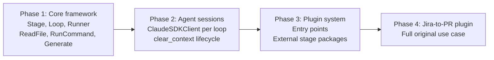

# Pipeline Framework — Plan

A generic, pluggable pipeline framework for orchestrating multi-step AI agent workflows. The Jira-to-PR use case is a future plugin — not the starting point.

## Goal

Build a framework where you define pipelines as sequences of stages and loops using a Python DSL, and the framework handles execution, context management, retries, and structured data passing between stages.

## Starting Small

Phase 1 delivers a working pipeline that does something trivial end-to-end:

```
read a Java file → ask Claude to generate a class based on it → compile it
```

This exercises every core concept: stages, loops, context clearing, structured outputs, agent sessions, and failure handling — without needing Jira, GitHub, or any external service.

## Phase 1: Minimal Pipeline Framework

### What we build

```python
from pipeline.dsl import *

config = (
    Pipeline("hello")

    .stage("read_spec",
        ReadFile(path="spec.txt"),
        on_failure=fail,
    )

    .clear_context()

    .loop("generate_and_build", max_retries=3, on_exhaust=fail,
        stages=[
            Stage("generate", Generate(
                prompt="Create a Python class based on this spec: {read_spec.output}",
                output_file="src/greeter.py",
            )),
            Stage("check", RunCommand(cmd="python -m py_compile src/greeter.py")),
            Stage("test", RunCommand(cmd="python -m pytest tests/test_greeter.py -v")),
        ]
    )
)
```

This pipeline:
1. Reads `spec.txt` (no agent needed — pure Python stage)
2. Clears context
3. Loops: Claude generates a Python class → `py_compile` checks syntax → `pytest` runs tests. If any step fails, the loop retries — Claude sees the error and fixes the code.

### Architecture

```
norn/
├── __init__.py
├── dsl.py                # Pipeline, Stage, Loop, clear_context, fail, ask_user, draft_pr
├── models.py             # StageResult, PipelineContext, PipelineState
├── runner.py             # Executes the pipeline: runs stages, handles loops, clears context
├── stages/
│   ├── base.py           # Abstract Stage class
│   ├── read_file.py      # ReadFile — reads a file, returns content as output
│   ├── generate.py       # Generate — runs claude-agent-sdk to produce a file
│   └── run_command.py    # RunCommand — runs a shell command, returns exit code + output
└── cli.py                # Entry point: `python -m pipeline run hello.py`
```

### Core Classes

```python
# --- models.py ---

@dataclass
class StageResult:
    name: str
    success: bool
    output: Any              # Structured output, available to later stages
    error: str | None = None

@dataclass
class PipelineContext:
    results: dict[str, StageResult]   # stage_name → result

    def get(self, stage_name: str) -> Any:
        """Get output from a previous stage."""
        return self.results[stage_name].output


# --- stages/base.py ---

class Stage(ABC):
    name: str

    @abstractmethod
    async def run(self, ctx: PipelineContext) -> StageResult:
        """Execute this stage. Return success/failure + structured output."""
        ...
```

### Runner Logic

```python
# --- runner.py (pseudocode) ---

async def run_pipeline(pipeline: Pipeline):
    ctx = PipelineContext(results={})

    for item in pipeline.items:  # items = stages, loops, clear_context markers

        if item is ClearContext:
            # Keep structured results, discard agent session
            agent_session = None
            continue

        if item is Stage:
            result = await item.run(ctx)
            ctx.results[item.name] = result
            if not result.success:
                handle_failure(item.on_failure, result)

        if item is Loop:
            for attempt in range(item.max_retries):
                all_passed = True
                for stage in item.stages:
                    if isinstance(stage, Loop):
                        # Nested loop — recurse
                        ...
                    result = await stage.run(ctx)
                    ctx.results[stage.name] = result
                    if not result.success:
                        all_passed = False
                        break  # Restart the loop
                if all_passed:
                    break
            else:
                handle_failure(item.on_exhaust, result)
```

### Built-in Stage Types (Phase 1)

| Stage Type | What it does | Needs agent? |
|---|---|---|
| `ReadFile(path=...)` | Reads a file, returns content as output | No |
| `RunCommand(cmd=...)` | Runs a shell command, returns stdout/stderr/exit code | No |
| `Generate(prompt=..., output_file=...)` | Sends prompt to Claude via `claude-agent-sdk`, writes output to file | Yes |

The example uses `RunCommand` for both `py_compile` (syntax check) and `pytest` (tests). The test file is provided upfront — Claude only generates the implementation.

### DSL Primitives (Phase 1)

| Primitive | Purpose |
|---|---|
| `Pipeline("name")` | Root container |
| `.stage("name", StageType(...), on_failure=...)` | Add a stage |
| `.loop("name", max_retries=N, on_exhaust=..., stages=[...])` | Add a do-while loop |
| `.clear_context()` | Discard agent session, keep structured outputs |
| `fail` | Abort pipeline |
| `ask_user` | Pause and ask user |

### What we defer

- Plugin system (loading stages from external packages)
- Agent session management (for Phase 1, each `Generate` stage is a standalone `query()` call)
- Config directory scanning
- Credentials management
- Notifications

## Phase 2: Agent Sessions

Make `Generate` use `ClaudeSDKClient` for multi-turn sessions within a loop. Stages inside the same loop share a session — Claude remembers the compilation error when retrying.

```python
# Runner creates a session per loop iteration
async with ClaudeSDKClient(options=options) as client:
    for stage in loop.stages:
        if stage.needs_agent:
            result = await stage.run(ctx, client)  # Reuse session
        else:
            result = await stage.run(ctx)
```

`clear_context()` between loops = new `ClaudeSDKClient` session.

## Phase 3: Plugin System

Stages become loadable from external packages. An org installs `issueprocessing-jira` and gets `ReadIssue`, `MatchRepo`, etc.

```python
# Entry points in pyproject.toml of a plugin package:
[project.entry-points."pipeline.stages"]
read_issue = "issueprocessing_jira:ReadIssue"
match_repo = "issueprocessing_jira:MatchRepo"
```

```python
# In a pipeline config:
from pipeline.dsl import *
# Plugin stages are auto-discovered via entry points
config = (
    Pipeline("jira-to-pr")
    .stage("read_issue", ReadIssue(...))
    ...
)
```

## Phase 4: Jira-to-PR Plugin

Reimplement the original use case as a plugin package `issueprocessing-jira`:
- `ReadIssue`, `MatchRepo`, `Clone` — triage stages
- `Analyze`, `Plan` — analysis stages (read-only agent tools)
- `WriteTest`, `Fix`, `VerifyTest`, `FullBuild`, `Coverage` — coding stages
- `Push`, `CI`, `Ship` — shipping stages

The pipeline config from `main-plan.md` works unchanged — it just uses stages from this plugin.

## Implementation Order



### Phase 1 Tasks

1. `norn/models.py` — `StageResult`, `PipelineContext`
2. `norn/stages/base.py` — abstract `Stage` class
3. `norn/stages/read_file.py` — `ReadFile`
4. `norn/stages/run_command.py` — `RunCommand`
5. `norn/stages/generate.py` — `Generate` (simple `query()` call)
6. `norn/dsl.py` — `Pipeline`, `Loop`, `ClearContext`, `fail`, `ask_user`
7. `norn/runner.py` — execute pipeline, handle loops and failures
8. `norn/cli.py` — `python -m pipeline run config.py`
9. Test: the "read spec → generate → check → test" example works end-to-end

### Example: Phase 1 End-to-End Test

```
# spec.txt
Create a Python class called Greeter with:
- A constructor that takes a name (str)
- A method greet() that returns "Hello, {name}!"

# tests/test_greeter.py (provided, not generated)
from src.greeter import Greeter

def test_greet():
    g = Greeter("World")
    assert g.greet() == "Hello, World!"

def test_greet_different_name():
    g = Greeter("Alice")
    assert g.greet() == "Hello, Alice!"

# Run:
python -m pipeline run examples/hello.py

# Expected:
# [read_spec] Read spec.txt (127 chars)
# [generate] Claude generated src/greeter.py
# [check] python -m py_compile src/greeter.py → exit 0
# [test] python -m pytest tests/test_greeter.py -v → exit 0 (2 passed)
# Pipeline completed successfully.

# If tests fail (e.g. Claude used wrong format string):
# [test] python -m pytest tests/test_greeter.py -v → exit 1: AssertionError
# [generate] Retrying (attempt 2/3)... Claude sees the error, regenerates
# [check] python -m py_compile src/greeter.py → exit 0
# [test] python -m pytest tests/test_greeter.py -v → exit 0 (2 passed)
# Pipeline completed successfully.
```
